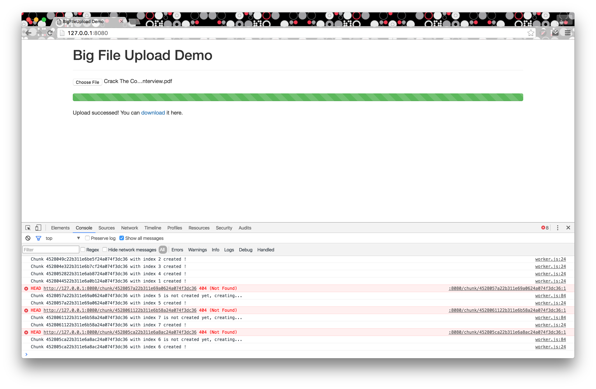

BigFileUpload
=============

Design
======

- 借鉴了分布式文件系统的一些设计思想
- 把文件分成一个一个chunk，然后利用worker多线程上传
- DFS 的Master 对应这里的File Model，用来管理Chunks
- 用Redis来保存 File 和 Chunk 的信息
- 工作流程
  - 用户选择文件上传，触发上传事件
  - `OPTIONS /` 获得Chunk Size 等配置信息
  - 根据配置信息`POST /file` 创建 File
  - 启动多个worker同时工作, 对于每个worker
    - 首先`OPTIONS /chunks/{chunk_id}` 获取相应chunk的状态
      - 如果该chunk还没有被初始化，这时会返回404，客户端`POST /chunks`创建该chunk
      - 否则Response头里边包含Chunk-Offset，客户端根据Chunk-Offset `PATCH` 上传(即断点上传)
    - 每个worker 执行完通知主线程，启动下一个 worker

Requirement
==========
- 需要安装Redis
- 能支持ES6工作的浏览器，比如较新版本的Chrome

How to run
=========

- git clone 到本地
- `chmod +x run.sh && ./run.sh`

Note
====
- 上图中OPTIONS查询chunk的时候，如果chunk没有创建会报404错误，这个是正常的，
  你可以把console里边的404报告给去掉

TODO
====
- 自动把ES6转换为ES5
- 多线程下载
- 取消上传
- 定期清除过期的上传失败的文件
